# LEZIONE 1

### INTRO

La Shell è un programma che prende un'input da tastiera e lo trasferisce all'OS.
Solitamente preinstallata nelle distribuzioni Linux si ha BASH, *Bourne Again SHell*.
Quando si usa una GUI si necessita di un programma, **l'emulatore di terminale** per
interagire con la shell. Quando la shell è pronta a ricevere l'input si ha lo **shell prompt**:
```shell
[me@linuxbox ~]$
```
Se alla fine si ha il simbolo \# si indica che si hanno i permessi di *superuser*:
```shell
[me@linuxbox ~]#
```
Nella shell si ha la *history* dei vecchi comandi (solitamente fino a 1000) utilizzando le frecce su e giù.
Con le frecce destra e sinistra ci si sposta col cursore nel comando.
Vediamo qualche comando base d'esempio:

* Per ora e data corrente:
  ```shell
  [me@linuxbox ~]$ date
  Thu Mar 8 15:09:41 EST 2018
  ```
* Per il calendario:
  ```shell
  [me@linuxbox ~]$ cal
  March 2018 
  Su Mo Tu We Th Fr Sa
               1  2  3
   4  5  6  7  8  9  10
  11 12 13 14 15 16 17
  18 19 20 21 22 23 24
  25 26 27 28 29 30 31
  ```
* Per vedere l'uso di memoria sui dischi e sulle varie partizione:
  ```shell
  [me@linuxbox ~]$ df
  File system    1K-blocks       Used  Available Use% Mounted on
  dev               4014968         0   4014968   0% /dev 
  run               4023532      9784   4013748   1% /run
  /dev/sda28      131449884 112330780  12412112  91% /
  tmpfs             4023532     36680   3986852   1% /dev/shm
  ```
* Per vedere l'uso della RAM:
  ```shell
  [me@linuxbox ~]$ free
                total        used        free      shared     buff/cache  available
  Mem:        8047068     2504188     1657424      357836     3885456     4839276
  Swap:             0           0           0

  ```
* Per terminare la sessione uso o Ctrl-d o:
  ```shell
  [me@linuxbox ~]$ exit
  ```
Inoltre si hanno delle sessioni di temrinale che girano sempre dietro la gui e sono accessibili con Ctrl-Alt + i tasti da F1 a F6; generalmente con
Alt-F7 si torna alla GUI.

### NAVIGAZIONE

Nei sistemi UNIX i file sono organizzati in una *hierical directory structure*, 
quindi in una struttura ad albero. La prima cartella è quindi chiamata *root directory*
e contiene files e altre sottocartelle. I sistemi UNIX e UNIX-Like hanno un unico albero per tutti i device i quali vengono in caso montati in un determinato punto dell'albero a seconda del volere di chi gestisce il sistema.

Per vedere in che posizione dell'labero ci troviamo (ovvero in che cartella ci troviamo) si ha:
```shell
[me@linuxbox ~]$ pwd
/home/me
```
Inoltre all'avvio ci troveremo nella cartella */home*, diversa per ciascun account. Infatti dentro */home* si hanno le varie sottocartelle degli utenti (una per ogni utente).
Per vedere cosa contiene una cartella, elencando files e directories uso:
```shell
[me@linuxbox ~]$ ls
Desktop Documents file.txt Music Pictures Public Templates Videos
```
Specificando il percorso possiamo vedere il contenuto di una determinata cartella
```shell
[me@linuxbox ~]$ ls Documents
document.txt other
```
per elencare anche file e directory nascoste uso:
```shell
[me@linuxbox ~]$ ls -a Documents
document.txt other .test .test.d
```
possiamo specificare più directories:
```shell
[me@linuxbox ~]$ ls ~ Documents
/home/me:
Desktop Documents file.txt Music Pictures Public Templates Videos
/home/me/Documents:
document.txt other
```
possiamo anche richiedere informazioni sui file:
```shell
[me@linuxbox ~]$ ls -l Documents
drwxr-xr-x 2 me me 4096 30 apr 11.37 other
-rw-r--r-- 2 me me 4096 30 apr 11.37 document.txt
```
con:
<p align="center">
  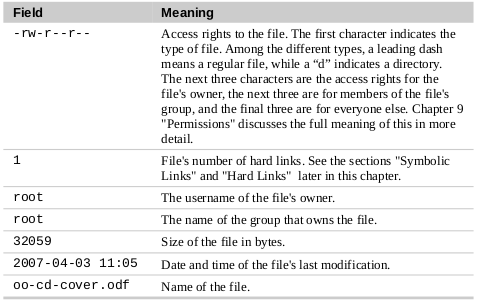
</p>

Il percorso di file o di una directory può essere specificato in due modi:
1) **con il PERCORSO ASSOLUTO**, ovvero indicando ogni cartella e sotto cartella 
   fino a quella desiderata, per esempio */home/Documents/*. Si ricorda che il primo "/" indica la cartella di root
2) **con il PERCORSO RELATIVO**, che invece da partiren dalla cartella di root parte dalla cartella corrente. Si hanno anche "." per indicare la cartella corrente e 
  ".." per indicare quella precedente, quindi:
  ```shell
  [me@linuxbox ~]$ pwd
  /home/me
  [me@linuxbox ~]$ ls
  Documents
  [me@linuxbox ~]$ cd ./Documents
  [me@linuxbox Documents]$ pwd
  /home/me/Documents
  [me@linuxbox Documents]$ cd ..
  [me@linuxbox ~]$ pwd
  /home/me
  [me@linuxbox ~]$ cd Documents
  [me@linuxbox Documents]$ pwd
  /home/me/Documents
  ```
<p align="center">
  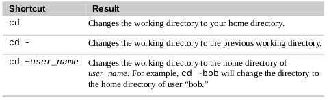
</p>

In UNIX i nomi di file e directory sono *case sensitive* e non si usano le estensioni per determinare il contenuto di un file. Per comodità **NON SI USANO SPAZI NEI NOMI DI FILES E DIRECTORIES**

Come abbiamo visto si possono dare opzioni ai vari comandi con il simbolo "-" seguito
da una lettera, oppure, in modalità estesa, con "--" seguito dal nome dell'opzione.
Per *ls* si ha, per esempio:
<p align="center">
  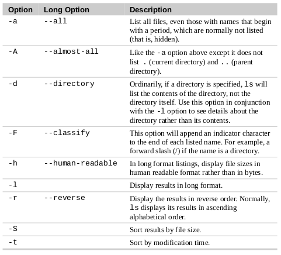
</p>

Per determinare il tipo di file, ricordando che l'estensione non implica alcun tipo preciso di file, si ha il comando file:
```shell
[me@linuxbox ~]$ file picture.jpg
picture.jpg: JPEG image data, JFIF standard 1.01
```
In Linux *everything is a file* e questo comporta l'esistenza di migliaia di tipi di file.

Per visualizzare file di testo si ha *less*, che permette di spostarsi su e giù con le frecce per visualizzaree il contenuto (per uscire usare "q"):
```shell
[me@linuxbox ~]$ less /etc/passwd
```
vediamo una tabella con le shortcut principali:
<p align="center">
  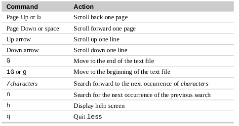
</p>

Torniamo sul directory tree, si hanno le seguenti direcory principali:
<p align="center">
  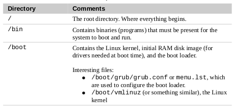
</p>
<p align="center">
  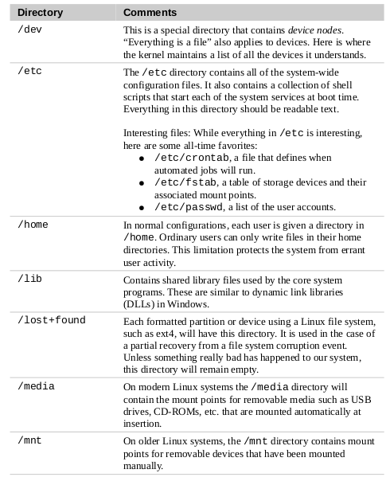
</p>
<p align="center">
  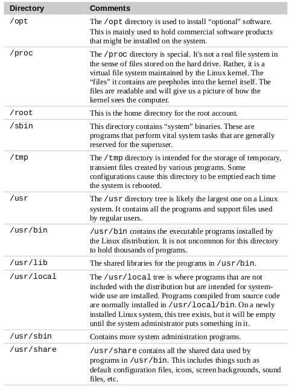
</p>
<p align="center">
  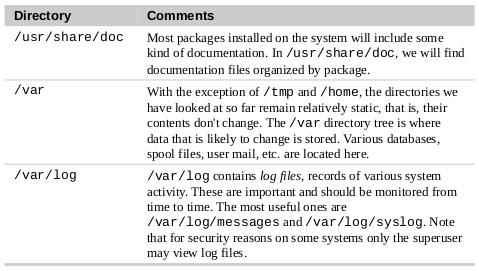
</p>

Vediamo un dettaglio:
```shell
[me@linuxbox ~]$ ls -l
lrwxrwxrwx 1 root root 11 2007-08-11 07:34 libc.so.6 -> libc-2.6.so
```
quella "l" all'inizio significa che abbiamo di fronte un link simbolico (*symlink*), con il link chiamato *libc.so.6*  che punta alla libreria condivisa *libc.2.6.so*.

### MANIPOLAZIONE DEI FILE

Prima di tutto introduciamo una feature della shell essenziale: le **wildcards**, ovvero dei caratteri speciali che si usano per specificare l'uso di più file in vase ad una certa richiesta:
<p align="center">
  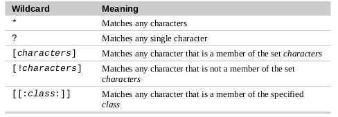
</p>
con (si usano anche le solite regole delle regex come [a-z] per indicare un carattere da a e z (minuscoli), [a-z]\*, per indicare n caratteri tra a e z (minuscoli) etc...):
<p align="center">
  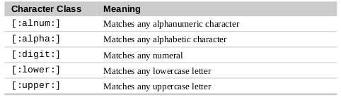
</p>
<p align="center">
  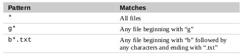
</p>
<p align="center">
  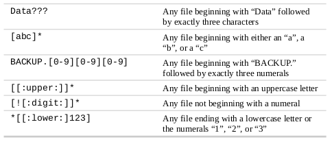
</p>

Per creare una directory usiamo *mkdir* seguito dal nome della cartella, o di più cartelle:
```shell
[me@linuxbox ~]$ ls 
dir1 dir2
[me@linuxbox ~]$ mkdir dir3 dir4
[me@linuxbox ~]$ ls 
dir1 dir2 dir3 dir4
```

Per copiare si ha il comando *cp*. Si può copiare il file/direcory in un altro/a con (da source a dest):
```shell
[me@linuxbox ~]$ cp source dest
```
si possono copiare più files mettendoli in sequenza (o usando una wildcard).
Si hanno le seguenti opzioni:
<p align="center">
  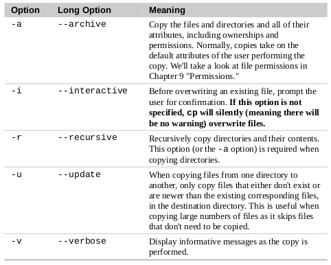
</p>
Vediamo qualche esempio:
<p align="center">
  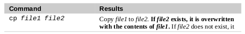
</p>
<p align="center">
  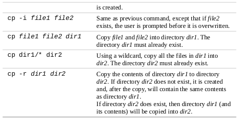
</p>

Per spostare un file in un altro uso *mv*:
```shell
[me@linuxbox ~]$ mv source dist
```
Si hanno le seguenti opzioni:
<p align="center">
  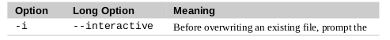
</p>
Vediamo qualche esempio:
<p align="center">
  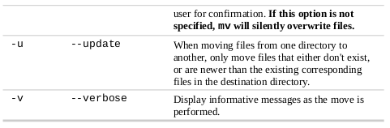
</p>
<p align="center">
  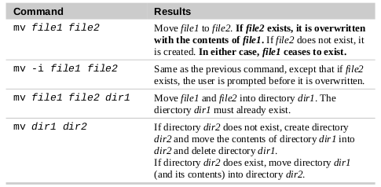
</p>

Per eliminare file e direcories (con -r) uso *rm*:
```shell
[me@linuxbox ~]$ ls
file.txt file2.txt
[me@linuxbox ~]$ rm file2.txt
[me@linuxbox ~]$ ls
file.txt
```
Si hanno le seguenti opzioni:
<p align="center">
  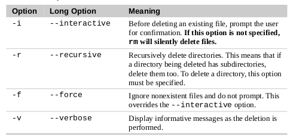
</p>
Vediamo qualche esempio:
<p align="center">
  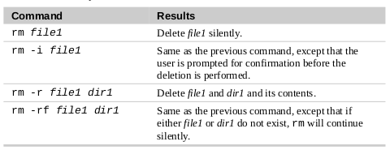
</p>

per creare link, sia hard links che symlinks, uso *ln*. Per un link normale:
```shell
[me@linuxbox ~] ln file link
```
Per un link simbolico:
```shell
[me@linuxbox ~] ln -s file link
```

### COMANDI PER LA PRODUTTIVITÀ

I comandi possono essere built-in della shell, programmi, alias o funzioni della shell.
Con *type* possono essere identificati:
```shell
[me@linuxbox ~]$ type type
type is a shell builtin
[me@linuxbox ~]$ type ls
ls is aliased to `ls --color=tty'
[me@linuxbox ~]$ type cp
cp is /bin/cp
[me@linuxbox ~]$ type emacs
emacs is /usr/bin/emacs
```

Per determinare dove si trova un eseguibile (solo un eseguibile non un alias o altro) uso *which*:
```shell
[me@linuxbox ~] which ls
/bin/ls
```

Ci sono vari modi per ottenere per ottenere la documentazione di un comando.

Bash ha il comando built-in *help*:
```shell
[me@linuxbox ~]$ help cd
cd: cd [-L|[-P [-e]] [-@]] [dir]
    Change the shell working directory.
    
	Change the current directory to DIR.
    value of the HOME shell variable.

    ... 
    Options:
       -L force symbolic links to be followed: resolve symbolic
       links in DIR after processing instances of `..'
       ...
```
Molti eseguibili hanno *--help*:
```shell
[me@linuxbox ~]$ mkdir --help
Usage: mkdir [OPTION] DIRECTORY...
Create the DIRECTORY(ies), if they do not already exist.
   -Z, --context=CONTEXT (SELinux) set security context to CONTEXT
   ...
```
Quasi tutti hanno la *man page*, richiamabile con *man*:
```shell
[me@linuxbox ~]$ man ls
```
Una man page è divisa in 8 sezioni:
1) User commands
2) Programming interfaces for kernel system calls
3) Programming interfaces to the C library
4) Special files such as device nodes and drivers
5) File formats
6) Games and amusements such as screen savers
7) Miscellaneous
8) System administration commands

richiamabili, per esempio per il *file formats* di passwd si ha:
```shell
[me@linuxbox ~]$ man 5 passwd
```

Con *apropos* si cerca una parola chiave nei vari man, ottenendo i comandi più consoni, tra parenetsi è indicata la sezione:
```shell
[me@linuxbox ~]$ apropos partiton
addpart (8)   - simple wrapper around the "add partition"...
all-swaps (7) - event signalling that all swap partitions...
cfdisk (8)    - display or manipulate disk partition table
cgdisk (8)    - Curses-based GUID partition table (GPT)...
delpart (8)   - simple wrapper around the "del partition"...
fdisk (8)     - manipulate disk partition table
fixparts (8)  - MBR partition table repair utility
...
```
 
Esiste anche *whatis* che mostra una linea di descrizione:
```shell
[me@linuxbox ~]$ whatis ls
ls        (1) - list directory contents
```

GNU Project mette ancge a disposizionje *info* che mostra le informazioni in un reader come quello di *less*. Si hanno le seguenti opzioni:
<p align="center">
  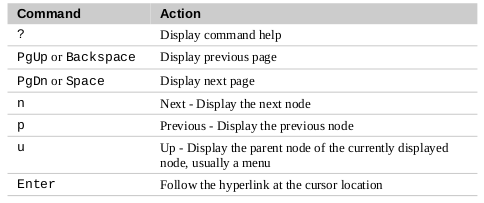
</p>

Si possono mettere più comandi in sequenza con ";":
```shell
[me@linuxbox ~]$ cd /usr; ls; cd -
bin games include lib local sbin
/home/me
[me@linuxbox ~]$
```
Per creare alias si ha:
```shell
[me@linuxbox ~]$ alias foo='cd /usr; ls; cd -'
```
che può essere aggiunto al *.bashrc* o al file di config della propria shell (*.zshrc* etc...).

Per rimuovere un alias uso:
```shell
[me@linuxbox ~]$ unalias foo
[me@linuxbox ~]$ type foo
bash: type: foo: not found
```
Con *alias* elenco tutti i vari aliases:
```shell
[me@linuxbox ~] alias
alias ls='ls --color=tty'
...
```
### REDIREZIONAMENTO

Esistono due tipi di output:
1) il risultato dell'esecuzione di un programma
2) un messaggio di stato o di errore indicante come procede l'esecuzione

Dato che *everything is a file* programmi come *ls* direzionano il risultato su un file chiamato
*standard output (stdout) e gli errori su uno chiamato *standard error (stderr)*.
Questi file non vengono salvati su disco ma vengono reindirizzatti allo schermo.
Molti programmi hanno anche uno *standard input (stdin)* collegato alla tastiera.
**Tutte ciò può, ovvero l'I/O, essere reindirizzato.**

Per reindirizzare lo stdout verso un file uso l'operatore ">" seguito dal nome del file:
```shell
[me@linuxbox ~]$ ls -l /usr/bin > ls-output.txt
```
abbiamo quindi un file di testo, abbastanza grande, col risultato di *ls*:
```shell
[me@linuxbox ~]$ ls -l ls-output.txt
-rw-rw-r-- 1 me   me   167878 2018-02-01 15:07 ls-output.txt
```
Se però facciamo:
```shell
[me@linuxbox ~]$ ls -l /bin/usr > ls-output.txt
ls: cannot access /bin/usr: No such file or directory
```
non avremo l'output sul file in quanto *ls* non direziona gli errori su *stdout* ma su *stderr*.
Nonostante non ci sia nulla da scrivere però il file viene creato, vuoto, in quanto ">"
riscrive sempre il file dall'inizio. Quindi
si può usare questo trucco per creare file vuoti:
```shell
[me@linuxbox ~]$ > empty_file.txt
```
Se invece vogliamo fare l*append* invece di riscrivere usiamo l'operatore ">>":
```shell
[me@linuxbox ~]$ ls -l /usr/bin >> ls-output.txt
```
quindi se facciamo:
```shell
[me@linuxbox ~]$ ls -l /usr/bin >> ls-output.txt
[me@linuxbox ~]$ ls -l /usr/bin >> ls-output.txt
[me@linuxbox ~]$ ls -l /usr/bin >> ls-output.txt
[me@linuxbox ~]$ ls -l ls-output.txt
-rw-rw-r-- 1 me   me   503634 2018-02-01 15:07 ls-output.txt
```
scriviamo tre volte l'output sul file.

Se vogliamo reindirizzare tutto l'output, quindi anche lo *stderr*, possiamo dare:
```shell
[me@linuxbox ~]$ ls -l /bin/usr > ls-output.txt 2>&1
```
dove si reindirizza anche il *file descriptor 2*, ovvero lo *stderr*, al 
*file descriptor 1*, ovvero lo *stdout*, con *2>&1*.

Le versioni recenti di BASH consentono di vare lo stesso anche con:
```shell
[me@linuxbox ~]$ ls -l /bin/usr &> ls-output.txt
```
dove la notazione "&>" consente di reindirizzare sia sia *stdout* che *stderr*.
Si ha una notazione simile per l'*append* con ">>":
```shell
[me@linuxbox ~]$ ls -l /bin/usr &>> ls-output.txt
```

Spesso si ha la filosofia del *silence il golden* se non vogliamo l'output di un comando.
Spesso si applica nel caso di errori e messaggi di stato. Per far ciò si direziona 
su un file speciale chiamato */dev/null* che è un *system device* che  accetta l'input e non ci fa nulla:
```shell
[me@linuxbox ~]$ ls -l /bin/usr 2> /dev/null
```

Vediamo ora come concatenare files. *cat* legge il contenuto di un file e lo redireziona a *stdout*.
Quindi, per visualizzare semplicemente il contenuto di un file ho:
```shell
[me@linuxbox ~]$ cat ls-output.txt
```
Si può anche concatenare una serie di file usando cat:
```shell
[me@linuxbox ~]$ cat file1.txt file2.txt file3.txt > file_tot.txt
```
Ovviamente si possono usare le wildcards:
```shell
[me@linuxbox ~]$ cat movie.mpeg.0* > movie.mpeg
```
Senza un file *cat* aspetta un *stdin* e poi lo riporta come output, apettando poi un altro input.
Con *cat* si possono creare anche file (scrivendo il contenuto subito dopo l'immissione del comando):
```shell
[me@linuxbox ~]$ cat lazy_dog.txt
The quick brown fox jumped over the lazy dog.
```
Con ">" possiamo anche redirezionare lo *stdin* dalla tastiera al file di input.
```shell
[me@linuxbox ~]$ cat < lazy_dog.txt
The quick brown fox jumped over the lazy dog.
```

Parliamo ora delle *pipelines*, che si indica con "|" (il simpbolo di pipe appunto)
e permette di indirizzare lo *stdout* del primo comando nello *stdin* del secondo.
Per esempio reindirizziamo l'output di *ls* in *less*:
```shell
[me@linuxbox ~]$ ls -l /usr/bin | less
```
Solitamente le pipe si usano per "filtrare"
pagina 86
